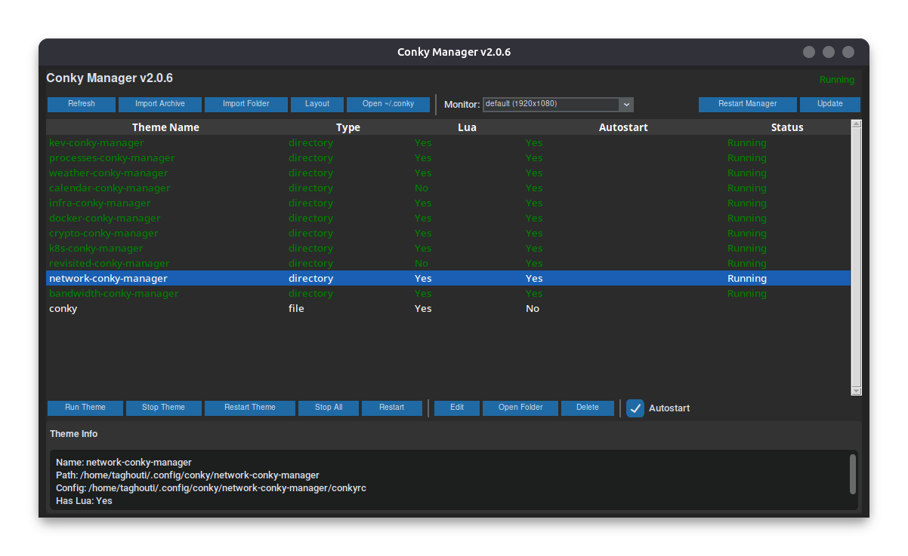
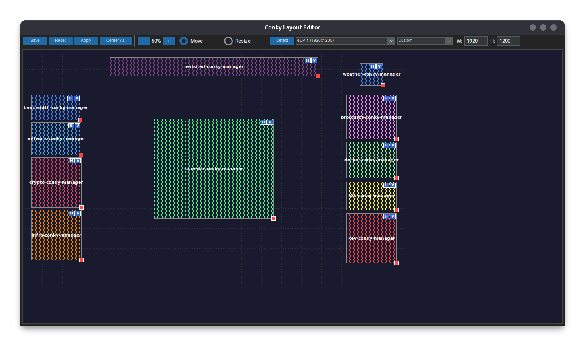
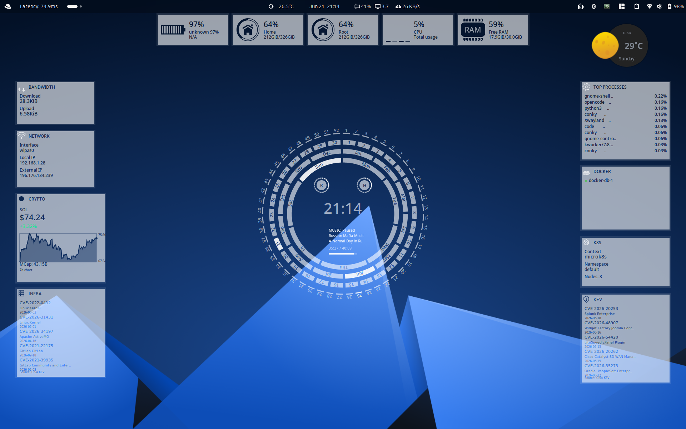

# Conky Manager

A full-featured Python/CustomTkinter GUI for managing Conky themes on Linux.

## Screenshots

### Manager


### Layout Editor


### Widgets


## Features

- **Theme Discovery** - Automatically scans `~/.config/conky/` for themes
- **Theme Switching** - Activate/deactivate themes with one click
- **Multi-Theme Support** - Run multiple themes simultaneously
- **Multi-Select** - Select and operate on multiple themes at once (Ctrl+Click / Shift+Click)
- **Run/Stop/Restart** - Start, stop, or restart selected themes
- **Restart All** - Restart all running themes at once
- **Search** - Filter themes in real-time by typing in the search bar
- **Archive Import** - Import themes from zip, tar, tar.gz, tar.xz, 7z
- **Folder Import** - Import themes directly from local folders
- **Autostart** - Configure themes to start on login via `.desktop` entries
- **Layout Editor** - Drag-and-drop interface for positioning widgets with zoom, alignment guides, and magnetic snapping
- **Auto-Update** - Check for updates from git repo (fetch + reset --hard, preserves user config values)
- **Settings** - Configure weather API key, city, country code, and bandwidth network interface
- **Theme Editing** - Edit theme configs directly from the manager
- **Theme Deletion** - Remove unused themes (multi-select supported)
- **Dark Mode** - Modern dark UI with blue accent theme via CustomTkinter
- **Wayland Support** - Full compatibility with Wayland (cairo_xlib optional via pcall)
- **Gray Theme Variants** - Solid dark gray backgrounds (#232323) for all themes, matching weather widget style
- **Theme Search** - Real-time case-insensitive search bar to filter themes by name

## Included Themes

All widgets run in a single conky instance per theme:

### Unified Themes (v3.0)
| Theme | Description |
|-------|-------------|
| `all-widgets-conky-manager` | All 11 widgets in one theme (white, semi-transparent backgrounds) |
| `all-widgets-gray-conky-manager` | All 11 widgets in one theme (solid dark gray #232323 backgrounds) |

### Widgets Included
| Widget | Description |
|--------|-------------|
| Network | Interface, local/external IP |
| Bandwidth | Download/upload speed |
| Processes | Top 10 processes by CPU |
| Docker | Running Docker containers |
| K8s | Kubernetes context, namespace, nodes |
| Crypto | Cryptocurrency prices with 7-day chart (configurable coin) |
| KEV | CISA Known Exploited Vulnerabilities with flashing dot |
| Infra | Infrastructure CVEs with flashing dot |
| Weather | Weather display with OpenWeatherMap API (configurable city) |
| Calendar | Calendar with circular design, clock, music player |
| Revisited | Desktop widgets (battery, disk, CPU, RAM) |

## Installation

### Option 1: .deb Package (Recommended)

```bash
# Download and install
sudo dpkg -i conky-manager_3.0.0_all.deb
sudo apt install -f  # Fix dependencies if needed
```

### Option 2: Install Script

```bash
git clone https://github.com/taghouti-org/conky-manager.git
cd conky-manager
sudo bash install.sh
```

### Option 3: Manual Install

```bash
# Install dependencies
sudo apt install conky python3-tk lua5.3 git

# Clone and install
git clone https://github.com/taghouti-org/conky-manager.git
cd conky-manager

# Copy to /opt
sudo cp -r . /opt/conky-manager

# Create launcher
mkdir -p ~/.local/bin
cat > ~/.local/bin/conky-manager << 'EOF'
#!/bin/bash
exec python3 "/opt/conky-manager/conky_manager.py" "$@"
EOF
chmod +x ~/.local/bin/conky-manager

# Copy themes
cp -r themes/*-conky-manager ~/.config/conky/

# Create desktop entry
mkdir -p ~/.local/share/applications
cat > ~/.local/share/applications/conky-manager.desktop << EOF
[Desktop Entry]
Name=Conky Manager
Exec=~/.local/bin/conky-manager
Icon=conky-manager
Terminal=false
Type=Application
Categories=Utility;System;
EOF
```

### Dependencies

```bash
# Required
sudo apt install conky python3-tk lua5.3 git
pip3 install customtkinter

# Optional (for specific themes)
pip3 install pyowm  # Weather theme
sudo apt install lm-sensors  # Calendar theme
```

## Usage

```bash
# Launch the GUI
conky-manager

# Or run directly
python3 /opt/conky-manager/conky_manager.py
```

### Manager Features

- **Run Theme** - Start selected theme(s)
- **Stop Theme** - Stop selected theme(s)
- **Restart Theme** - Restart selected theme(s)
- **Stop All** - Stop all running themes
- **Restart** - Restart all running themes
- **Layout** - Open drag-and-drop layout editor
- **Settings** - Configure weather API key, city, country code, and bandwidth network interface
- **Update** - Check for and apply updates from git repo
- **Restart Manager** - Restart the manager application

### Layout Editor

The layout editor provides a visual interface for positioning widgets:

- **Move Mode** - Drag widgets to reposition
- **Resize Mode** - Drag corners to resize (per-widget minimum sizes enforced)
- **Zoom +/-** - Zoom in/out for precision
- **Save** - Save positions to layout.json and positions.lua
- **Apply** - Update positions, restart affected themes
- **Center All** - Center all widgets on screen
- **H/V Buttons** - Per-widget horizontal/vertical center buttons (top-right corner)
- **Multi-Select** - Ctrl+Click to select multiple widgets, drag moves all together
- **Alignment Guides** - Red dashed lines appear when dragging near alignment points
- **Magnetic Snapping** - Snaps to widget edges/centers, screen edges, and screen center (2px threshold)
- **Equal Spacing Snap** - Snaps when gap matches existing gap between other widgets
- **Monitor Selection** - Detect monitors via xrandr, launch conky on selected monitor
- **Resolution Presets** - 1920x1080, 2560x1440, 3840x2160, or custom W/H
- **Fullscreen on Open** - Opens maximized by default

### Auto-Update

The manager automatically checks for updates on startup:
- Compares local version with remote VERSION file
- Shows "Update (NEW)" button when updates available
- Uses `git fetch` + `reset --hard` + `clean -fdx` (handles diverged branches)
- Preserves user config values (API key, city, iface, coin settings) during update
- Updates manager files and all themes
- Backs up current installation before applying

## Conky 1.19 Compatibility

This manager supports Conky 1.19+ with Lua-based configuration:

```lua
conky.config = {
    background = false,
    update_interval = 1,
    own_window = true,
    own_window_type = 'normal',
    font = 'Dejavu Sans:size=10',
    minimum_width = 300,
    minimum_height = 200,
}

conky.text = [[
${cpu}%
]]
```

### Deprecated Syntax (do not use)

- `xftfont` → use `font`
- `minimum_size W H` → use `minimum_width = W,` and `minimum_height = H,`

## Unified Widget Positioning

All themes use the same positioning model:

1. **Fullscreen window** (1920x1200) with `alignment = 'top_left'`, `gap_x = 0`, `gap_y = 0`
2. **Shared positions.lua** (`~/.config/conky/positions.lua`) loaded by all themes via `lua_load`
3. **Themes read positions at runtime**: `positions["<theme-name>"].x/.y`
4. **Layout editor** writes both `layout.json` and `positions.lua`
5. **Auto-restart** after applying positions so changes take effect
6. **Monitor support** via `-m <monitor>` flag, stored in layout.json

This ensures the same logic works for all themes (system widgets, calendar, weather, revisited, etc.).

## Testing

Non-regression test suite with 76 tests covering theme structure, Lua syntax, business logic, and layout editor.

```bash
# Install test dependencies
pip3 install pytest pytest-cov

# Run all tests
pytest tests/ -v

# Run with coverage
pytest tests/ -v --cov=. --cov-report=term-missing

# Run specific test file
pytest tests/test_theme_structure.py -v
pytest tests/test_lua_syntax.py -v
pytest tests/test_layout_editor.py -v
pytest tests/test_conky_manager.py -v
```

## Uninstall

```bash
# Using uninstall script
sudo bash /opt/conky-manager/uninstall.sh

# Or using .deb
sudo dpkg -r conky-manager
```

## File Locations

| Path | Description |
|------|-------------|
| `/opt/conky-manager/` | Installation directory |
| `~/.config/conky/` | Theme configurations |
| `~/.config/conky/positions.lua` | Shared widget positions for all themes |
| `~/.config/conky/layout.json` | Layout state (resolution, monitor, positions) |
| `~/.local/share/conky-manager/` | Manager data and backups |
| `~/.local/bin/conky-manager` | Launcher script |
| `~/.local/share/applications/conky-manager.desktop` | Desktop entry |

## License

MIT License
